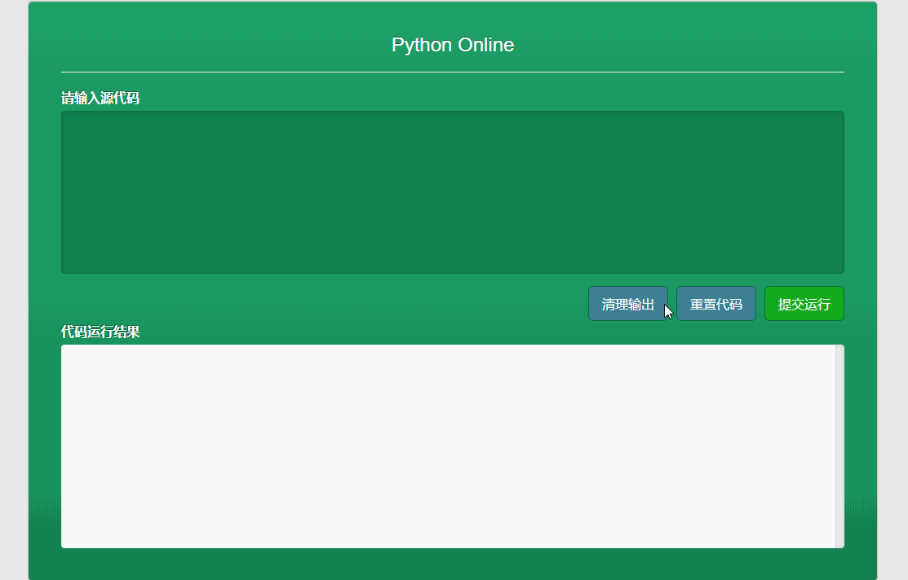

## PythonOnline

### 1 写在前面
更好的文章体验请访问我的个人网站：<a href="liushangyu.xyz" target=new>Atlantis</a>

这个项目提供了一个对python程序进行在线运行的工具，我们只需要在输入区写入自己的代码，点击`提交运行`即可将程序推送到server后台，后台运行程序后将标准输出和标准错误返还给前端，在页面下方将得到程序的运行结果。下面是最终的界面效果：



做这个实验的目的原本是为了做一个轻量级的神经网络模型输出展示，希望将模型运行在服务器后台，通过网页提交表单，将数据传送给模型，在前端再将模型的输出展示出来。由于模型还没有训练结束，我就打算先用PythonOnline这样的项目进行测试。

这是一个无框架的web实验，只需要一个本地可用的python3运行环境，一个谷歌浏览器即可。我们将使用python作为sever后台控制语言，使用jQuery做前端表单提交，使用bootstrap作为前端UI库。
### 2 编写HTTP服务器
实现HTTP服务器的代码主要参考了博客<a href="https://www.cnblogs.com/xinyangsdut/p/9099623.html" target=new>Python实现简单HTTP服务器</a>中`返回动态内容(运用wsgi）`一节给出的例程代码，但在例程的基础上有所改动。我们在表单中加入了一项参数：`CMD`以传递程序原文。并且我使用的是`post`方法，所以参数数据是加在请求头的后面的。这里要注意，原博客用的是`get`方法，参数是在请求头之中的，这一点一定要注意。下面是增加的从请求报文获取参数字典的代码：
```python
...
request_datas_line = unquote(request_lines[-1].decode("utf-8").replace("+", " "))
...
params = {}
if request_datas_line:
    for param in request_datas_line.split('&'):
        if '=' in param:
            tmp = re.match(r"([^=]+)=(.*)", param, re.DOTALL)
            params[tmp.group(1).upper()] = tmp.group(2)
...
```
注意这里的`urllib.parse.unquote`方法是用来解码URL的。在传递参数数据的时候，前端会将数据进行URL编码，将空格替换为加号，将加号、星号、除号等符号进行替换，避免与URL中的转义字符冲突。所以我们要得到数据原文需要进行URL解码，并将加号替换为空格。

多个参数之间是否是用与号连接还有待实验，目前只知道`get`方法时的格式如此。

将传入`application()`的params字典修改成如下，将原有字典中加入刚才获得的参数数据。
```python
params.update(dict({ "PATH_INFO": file_name, "METHOD": method}))
```
我们可以看出下面函数的功能即是调用URL中指定的文件m的application函数，并获取其返回值作为响应数据：
```python
response_body = m.application(params, self.start_response)
```
那么接下来的工作就是编写响应脚本。
### 2 编写后台响应脚本
在与server.py相同的目录下新建文件夹wsgi，在wsgi文件夹下新建文件run.py作为响应脚本。这部分也可以参考上节提到的博客，在`application()`函数中加入以下代码：
```python
if "CMD" in params and params["CMD"].strip():
	with open("tmp.py", 'w') as writer:
		writer.write(params["CMD"])
	data = os.popen("python tmp.py 2>err.log", 'r').read()
	if not data:
		data = open("err.log", 'r', encoding="utf-8").read()
	result = ""
	for line in data.split('\n'):
		result += "<p>{}</p>".format(line)
	return result
else:
	return "Bad Parameters!"
```
检测如果传来的字典中有`CMD`参数，且参数的值不为空，那么将新建一个`tmp.py`的临时python文件，将`CMD`的参数值，即前端输入的代码写入临时文件中，然后使用`os.popen()`方法运行该程序。注意这里的`os.popen()`函数只能捕捉标准输出流，并且是在程序运行结束后。如果运行的程序有异常，不能使用`try`包裹命令，将捕捉不到任何信息，同时data也只能得到空。所以我们在命令中加入`2>err.log`输出错误信息到文件`err.log`。还要注意，这个错误重定向的命令中不能有空格。检测data为空时，将错误日志的信息返还给前端。为了在前端能够多行显示，我们需要将输出每一行换成`<p></p>`标签包裹的段落。

如果前端传来的参数和值有错误，那么返回`Bad Parameters!`提示信息，仅供调试。

接下来还需要编写一个巧妙而美观的前端界面，并实现表单的提交。
### 3 编写前端界面
我们首先编写一个简陋的HTML界面框架，包含表单文字输入区和提交按钮。其中用到了bootstrap前端UI库，需要在header中包含相关文件的链接：
```htmlbars
<link rel="stylesheet" href="https://cdn.staticfile.org/twitter-bootstrap/3.3.7/css/bootstrap.min.css">
<script src="https://cdn.staticfile.org/twitter-bootstrap/3.3.7/js/bootstrap.min.js"></script>
```
下面只是为了讲解方便的一段节选，具体的样式表和HTML全文还请移步GitHub。
```htmlbars
<div class="card">
    <div class="card-body">
        <div id="pay-invoice">
            <div class="card-body">
                <div class="card-title">
                    <h3 class="text-center">Python Online</h3>
                </div>
                <hr>
                <form id="form" action="/run.py" novalidate="novalidate">
                    <div class="form-group">
                        <label class="control-label mb-1">请输入源代码</label>
                        <textarea type="text" id="cmd" class="form-control" spellcheck="false"></textarea>
                    </div>
                    <div>
			<button class="btn btn-lg bt-run" id="run">提交运行</button>
			<button class="btn btn-lg bt-reset" id="reset">重置代码</button>
			<button class="btn btn-lg bt-clear" id="clear">清理输出</button>
                    </div>
                </form>
                <div style="margin-top: 60px;">
                    <label class="control-label mb-1">代码运行结果</label>
		    <div class="result" id="result"></div>
		</div>
	    </div>
        </div>
    </div>
</div>
```
对于表单的提交功能，我们可以直接使用`javascript`自带的`form.submit()`方法提交表单，但没法获取提交后返回的数据。所以我使用了`jQuery`的`ajaxSubmit()`方法。
```javascript
$("#run").on('click', function() {
	$("#form").ajaxSubmit({
		type: 'post',
		data: {
			'cmd': $('#cmd').val()
		},
		dataType:'text',
		contentType: "application/x-www-form-urlencoded; charset=UTF-8",
		success: function(msg) {
			var time = "<p>[" + new Date().toLocaleTimeString() + "]</p>";
			$("#result").append(time + msg);
			var scrollHeight = $('#result').prop("scrollHeight");
  			$('#result').animate({scrollTop: scrollHeight}, 400);
		}
	});
	return false;
});
```
为了更好的用户体验，我使每次运行完程序后的输出接在以前的输出后面，并且滚动条自动滚动到底部以显示最新结果。另外还在结果的头部加入了时间信息，以区分不同的代码运行结果。在调试前端的过程中我遇到了几个重要的问题：

**中文乱码问题** HTML中的中文字符在浏览器上显示为乱码，只需要在header中加入：
```htmlbars
<meta http-equiv="Content-Type" content="text/html; charset=utf-8" />
```

**重复提交问题** 这是使用ajaxSubmit提交常出现的经典问题。一般来说有如下两个原因：

+ 在`<form>`标签处已设置`Action`，但在`ajaxSubmit()`中又设置了`URL`  
+ 在`ajaxSubmit()`外又包裹了一层`on('submit')`或`submit()`  

**Textarea中使用TAB** 网页表单中的TAB键默认是用来跳转焦点的，我们加入以下代码捕捉Textarea中的TAB键入，并将其转换为四个空格。
```javascript
$("textarea").on('keydown', function(e) {
    if (e.keyCode == 9) {
        e.preventDefault();
        var indent = '    ';
        var start = this.selectionStart;
        var end = this.selectionEnd;
        var selected = window.getSelection().toString();
        selected = indent + selected.replace(/\n/g, '\n' + indent);
        this.value = this.value.substring(0, start) + selected
                + this.value.substring(end);
        this.setSelectionRange(start + indent.length, start
                + selected.length);
    }
})
```
另外我还编写了用于清空代码输入和清空输出面板的按钮功能，在这里不再详述。最后在浏览器栏输入`localhost:8000`即可看到我们上文给出的界面效果了。
### 4 未来工作
我们可以给网站部署一些小应用。我将给博客中加入一个APPS界面，加入一些有意思的小工具。比如之前写过的二维码生成、字符画转换、主题色提取和五子棋人工智能等等。这个技术的突破使得很多复杂的Python程序能够被前台所调用，为未来开创了无限可能（我指的是我的项目的未来）。
